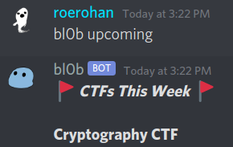

[![csivit][csivitu-shield]][csivitu-url]
<!-- ALL-CONTRIBUTORS-BADGE:START - Do not remove or modify this section -->
[](#contributors-)
<!-- ALL-CONTRIBUTORS-BADGE:END -->
[![Issues][issues-shield]][issues-url]

<!-- PROJECT LOGO -->
<br />
<p align="center">
  <a href="https://github.com/csivitu/bl0b">
    
  </a>
  <br />
  <a href="https://github.com/csivitu/bl0b">
    
  </a>

  <h3 align="center">bl0b</h3>

  <p align="center">
    A discord bot to notify you about upcoming CTFs from CTFtime, and more.
    <br />
    <a href="https://github.com/csivitu/bl0b"><strong>Explore the docs »</strong></a>
    <br />
    <br />
    <a href="https://github.com/csivitu/bl0b">View Demo</a>
    ·
    <a href="https://github.com/csivitu/bl0b/issues">Report Bug</a>
    ·
    <a href="https://github.com/csivitu/bl0b/issues">Request Feature</a>
  </p>
</p>


<!-- TABLE OF CONTENTS -->
## Table of Contents

* [About the Project](#about-the-project)
  * [Built With](#built-with)
* [Getting Started](#getting-started)
  * [Prerequisites](#prerequisites)
  * [Installation](#installation)
* [Usage](#usage)
* [Roadmap](#roadmap)
* [Contributing](#contributing)
* [License](#license)
* [Contributors](#contributors-)


<!-- ABOUT THE PROJECT -->
## About The Project




### Built With

* [golang](https://golang.org)
* [discordgo](https://github.com/bwmarrin/discordgo)
* [sqlx](https://github.com/jmoiron/sqlx)


<!-- GETTING STARTED -->
## Getting Started

The recommended way of deploying `bl0b` on your server is using `docker`.

### Prerequisites

* docker
* docker-compose

You can install docker and docker-compose with the help of the following links.

- docker: https://docs.docker.com/engine/install/
- docker-compose: https://docs.docker.com/compose/install/

### Installation

Assuming you have already obtained a bot token from `Discord`, you need to follow these steps to get the bot up and running.
 
1. Clone the repo and `cd` into it.
```sh
git clone https://github.com/csivitu/bl0b.git
cd bl0b
```

2. Create a file called `.env.prod` to store all the secrets (environment variables). Here's a sample:

```sh
DG_TOKEN=Bot Asf1fa94jfn1n3nfeqafn4231.saf1F3.Asff_dadfVdaw1354f_d-0NsMLSofpg
DB_USER=root
DB_PASS=root
DB_IP=db
DB_PORT=3306
```

The configuration above will work directly if you replace the token `Asf1fa94jfn1n3nfeqafn4231.saf1F3.Asff_dadfVdaw1354f_d-0NsMLSofpg` with your `Discord` bot token.

Here are some things to note:
* The DG_TOKEN _must_ have the prefix `Bot `. If the token you got from `Discord` does not begin with `Bot `, prepend it to the string as show in the sample above.
* If you're using `docker-compose`, make sure the `DB_IP` is `db`, i.e, the name of the service responsible for running the `mysql` database.
* The `DB_USER` must have permission to create a database, which is why it's easiest to set it to `root` if you're using the `docker-compose` way. If not, it is **not** recommended to set `DB_USER` to root, instead, create a `database` called `bl0b` and grant all permissions on that database to the `DB_USER`.

3. Run `bl0b` using `docker-compose`.
```sh
docker-compose up -d --build
```

Congratulations! You have `bl0b` up and running.


<!-- USAGE EXAMPLES -->
## Usage

Once you add `bl0b` to your server, you can request the help menu using the following command:

```sh
bl0b help
```

Alternatively, you can tag the bot or send it a DM.

```sh
# Tagging the bot
@bl0b help

# DM-ing the bot
help
```

The help menu lists all the commands you can use!


<!-- ROADMAP -->
## Roadmap

See the [open issues](https://github.com/csivitu/bl0b/issues) for a list of proposed features (and known issues).


<!-- CONTRIBUTING -->
## Contributing

Contributions are what make the open source community such an amazing place to be learn, inspire, and create. Any contributions you make are **greatly appreciated**.

1. Fork the Project
2. Create your Feature Branch (`git checkout -b feature/AmazingFeature`)
3. Commit your Changes (`git commit -m 'feat: Add some AmazingFeature'`)
4. Push to the Branch (`git push origin feature/AmazingFeature`)
5. Open a Pull Request

You are requested to follow the contribution guidelines specified in [CONTRIBUTING.md](./CONTRIBUTING.md) while contributing to the project :smile:.

<!-- LICENSE -->
## License

Distributed under the MIT License. See [`LICENSE`](./LICENSE) for more information.


<!-- MARKDOWN LINKS & IMAGES -->
<!-- https://www.markdownguide.org/basic-syntax/#reference-style-links -->
[csivitu-shield]: https://img.shields.io/badge/csivitu-csivitu-blue
[csivitu-url]: https://csivit.com
[issues-shield]: https://img.shields.io/github/issues/csivitu/bl0b.svg?style=flat-square
[issues-url]: https://github.com/csivitu/bl0b/issues

## Contributors ✨

Thanks goes to these wonderful people ([emoji key](https://allcontributors.org/docs/en/emoji-key)):

<!-- ALL-CONTRIBUTORS-LIST:START - Do not remove or modify this section -->
<!-- prettier-ignore-start -->
<!-- markdownlint-disable -->
<table>
  <tr>
    <td align="center"><a href="https://github.com/roerohan"><br /><sub><b>Rohan Mukherjee</b></sub></a><br /><a href="https://github.com/csivitu/bl0b/commits?author=roerohan" title="Code">💻</a> <a href="https://github.com/csivitu/bl0b/commits?author=roerohan" title="Documentation">📖</a></td>
  </tr>
</table>

<!-- markdownlint-enable -->
<!-- prettier-ignore-end -->
<!-- ALL-CONTRIBUTORS-LIST:END -->

This project follows the [all-contributors](https://github.com/all-contributors/all-contributors) specification. Contributions of any kind welcome!